# Table of contents

- [What is Bamboo Firewall?](#What-is-Bamboo-Firewall?)
- [Community](#Community)
- [Client OS Supported](#Client-OS-Supported)
- [Case studies](#Case-studies)
- [Architecture](#Architecture)
- [Resouces used](#Resouces-used)
- [Development roadmap](#Development-roadmap)
- [License](#License)

# What is Bamboo Firewall?

Bamboo Firewall is an opensource software firewall that supports network segmentation, Central management and
rules/polices as code. It is a host base firewall, so the policy is very strict. Unlike traditional firewalls, it
provides many functions for centralized policy setting as tag, label, range, annotations...

# Community

You can join the following groups or channels to discuss or ask questions about Bamboo Firewall, and to keep yourself
informed of the latest Bamboo Firewall updates:

- Seek help when you use BambooFW
    - Slack
      channels: [#everyone (Vietnamese, English)](https://join.slack.com/t/bamboo-firewall/shared_invite/zt-207jwcvcl-tIXUfYBKoe6TNPcce6iqXw)

# Client OS Supported
<table>
<thead>
  <tr>
    <th>OS</th>
    <th>Versions</th>
    <th>Verify by</th>
  </tr>
</thead>
<tbody>
  <tr>
    <td rowspan="3">Ubuntu</td>
    <td>Ubuntu 18.04 x64</td>
    <td>OK in GHTK</td>
  </tr>
  <tr>
    <td>Ubuntu 20.04 x64</td>
    <td>OK in GHTK</td>
  </tr>
  <tr>
    <td>Ubuntu 22.04 x64</td>
    <td>OK in GHTK</td>
  </tr>
  <tr>
    <td rowspan="3">CentOS</td>
    <td>CentOS 7</td>
    <td>Verified</td>
  </tr>
  <tr>
    <td>CentOS 8 Stream</td>
    <td>Verified</td>
  </tr>
  <tr>
    <td>CentOS 9 Stream</td>
    <td>Verified</td>
  </tr>
  <tr>
    <td rowspan="3">RHEL</td>
    <td>RHEL 7</td>
    <td>Verified</td>
  </tr>
  <tr>
    <td>RHEL 8</td>
    <td>Verified</td>
  </tr>
  <tr>
    <td>RHEL 9</td>
    <td>Verified</td>
  </tr>
  <tr>
    <td rowspan="3">Debian</td>
    <td>Debian 8</td>
    <td>Under checking</td>
  </tr>
  <tr>
    <td>Debian 9</td>
    <td>Under checking</td>
  </tr>
  <tr>
    <td>Debian 10</td>
    <td>Under checking</td>
  </tr>
  <tr>
    <td rowspan="2">FreeBSD</td>
    <td>FreeBSD 12.x</td>
    <td>Under checking</td>
  </tr>
  <tr>
    <td>FreeBSD 13.x</td>
    <td>Under checking</td>
  </tr>
</tbody>
</table>

# Case studies

- [Bamboo Firewall at GHTK](./case-studies/ghtk.md)

# Architecture

<p align="center">
  
</p>

- etcd cluster: Where stores metadata of bamboo firewall. ex: server endpoint, network zone, policies
- backend (be): API backend server. It provides API for frontend
- frontend (fe): Frontend provides user interfaces via webview
- cli: Command line provides console interface for administrator
- Agent: Agent installed each server and connect to etcd cluster to apply policies
- watcher: A job watch events from etcd to mongodb database (one way)

# bamboofw without agents for quickly setup development env
Install 
```sh 
cd demo/bamboofw_without_agent
# Get current IP & sed to docker-compose 
IP=$(ip -o route get to 8.8.8.8 | sed -n 's/.*src \([0-9.]\+\).*/\1/p') \
&& sed -Ei "s|DEMO_IP|$IP|g" docker-compose.yaml \
&& docker-compose up -d
```
- Login `localhost:3000` with user `admin` and defaut password `change_me`

- Overview 
<p align="center">
  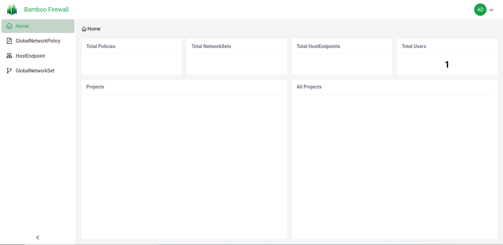
</p>

- Apply policies to endpoints
```sh
# SSH to manage-aio node and run
docker exec -it cli bash 
calicoctl datastore migrate lock
calicoctl datastore migrate unlock
bash /bamboofw/demo/init.sh
```

<p align="center">
  
</p>


# How to installation

- **Step 1**: Install etcd cluster
- **Step 2**: Install MongoDB (stand-alone or replication)
- **Step 3**: Install frontend, watcher and backend
- **Step 4**: Install agent to server which you want to apply polices and rules of firewall
- **Step 5**: write rules as code then apply to bamboo firewall

- For example: We have 7 servers below [Prepare demo server](./demo/vagrant/README.md)

| No  | HOSTNAME   | IPADDR             | INTERFACES | ROLE       | ZONE | PROJECT    | NAMESPCE    |
|-----|------------|--------------------|------------|------------|------|----------- |-------------|
| 1   | admin01    | 192.168.56.5       | eth1       | management | gray |  example   |  production |
| 2   | lb[01-02]  | 192.168.56.[11-12] | eth1       | lb         | black|  example   |  production |
| 3   | app[01-02] | 192.168.56.[21-22] | eth1       | app        | green|  example   |  production |
| 4   | db[01-02]  | 192.168.56.[31-32] | eth1       | db         | white|  example   |  production |


| No  | IP SRC              | PORT SRC | IP DST              | PORT DST | PROTO   | Details         |
|-----|---------------------|----------|---------------------|----------|---------|-----------------|
| 1   | any                 | any      | 192.168.56.[11-12]  | 443,80   | TCP     | Public Internet |
| 2   | 192.168.56.[11-12]  | any      | 192.168.56.[21-22]  | 80,443   | TCP     | LB to APP       |
| 3   | 192.168.56.[21-22]  | any      | 192.168.56.[31-32]  | 3306     | TCP     | APP to DB       |
| 4   | all-example-servers | any      | any                 | 123,53   | UDP/TCP | DNS and NTP     |
| 5   | 192.168.56.5        | any      | all-example-servers | any      | UDP/TCP | Management      |

- Struct folder to store rules:
```sh
.
├── gnp
│   ├── app-example.yaml
│   ├── basic-example.yaml
│   ├── db-example.yaml
│   └── lb-example.yaml
├── gns
│   ├── black.yaml
│   ├── gray.yaml
│   ├── green.yaml
│   └── white.yaml
├── hep
│   ├── 192.168.56.11-eth1.yaml
│   ├── 192.168.56.12-eth1.yaml
│   ├── 192.168.56.21-eth1.yaml
│   ├── 192.168.56.22-eth1.yaml
│   ├── 192.168.56.31-eth1.yaml
│   ├── 192.168.56.32-eth1.yaml
│   └── 192.168.56.5-eth1.yaml
```

- Detail example hostEndpoint
```sh
apiVersion: projectcalico.org/v3
kind: HostEndpoint
metadata:
  name: 192.168.56.5
  labels:
    role: management
    zone: gray
    namespace: production
    project: example
    ip: 192.168.56.5
spec:
  node: manage-aio
  interfaceName: eth1
  expectedIPs: ["192.168.56.5"]
```

- Detail example globalNetworkSets
```sh
apiVersion: projectcalico.org/v3
kind: GlobalNetworkSet
metadata:
  name: black
  labels:
    zone: black
    name: black
spec:
  nets:
    - 192.168.56.11/32
    - 192.168.56.12/32
```

- Detail example globalNetworkPolicy
```sh
apiVersion: projectcalico.org/v3
kind: GlobalNetworkPolicy
metadata:
  name: 'app-example'
spec:
  selector: ((role == 'app') && (project == 'example'))
  ingress:
    - action: Allow
      protocol: TCP
      source:
        selector: ((role == 'lb') && (project == 'example'))
      destination:
        ports: [80,443]    
  egress:
    - action: Allow
      protocol: TCP
      destination:
        selector: ((role == 'db') && (project == 'example'))
        ports: [3306]
```

- Deploy node manage 
```sh 
cd demo/playbook
ansible-playbook site.yml -l manage_aio -t manage_aio
```

- Check deploy node manage AIO 
```sh 
root@manage-aio:~# docker ps
CONTAINER ID   IMAGE                           COMMAND                  CREATED          STATUS          PORTS                                                                          NAMES
ce932a04246c   bamboofirewall/fe:v0.0.1        "docker-entrypoint.s…"   37 minutes ago   Up 37 minutes   0.0.0.0:3000->3000/tcp, :::3000->3000/tcp                                      fe
b5bd83d4ffa7   bamboofirewall/be:v0.0.1        "/app/calicobe"          37 minutes ago   Up 37 minutes   0.0.0.0:9091->9091/tcp, :::9091->9091/tcp                                      be
d4a79197e15c   bamboofirewall/watcher:v0.0.2   "/app/watcher"           37 minutes ago   Up 37 minutes                                                                                  watcher
f2ff45a711aa   bamboofirewall/cli:v0.0.1       "tail -f /dev/null"      37 minutes ago   Up 37 minutes                                                                                  cli
7d4e609807a4   mongo:6.0-jammy                 "docker-entrypoint.s…"   37 minutes ago   Up 37 minutes   27017/tcp                                                                      mongodb
0cb0005c33d7   quay.io/coreos/etcd:v3.5.9      "/usr/local/bin/etcd…"   37 minutes ago   Up 37 minutes   2379-2380/tcp, 0.0.0.0:2383-2384->2383-2384/tcp, :::2383-2384->2383-2384/tcp   etcd3
2037b456b535   quay.io/coreos/etcd:v3.5.9      "/usr/local/bin/etcd…"   37 minutes ago   Up 37 minutes   2379-2380/tcp, 0.0.0.0:2381-2382->2381-2382/tcp, :::2381-2382->2381-2382/tcp   etcd2
165da3f19ed8   quay.io/coreos/etcd:v3.5.9      "/usr/local/bin/etcd…"   37 minutes ago   Up 37 minutes   0.0.0.0:2379-2380->2379-2380/tcp, :::2379-2380->2379-2380/tcp                  etcd1
root@manage-aio:~# 
```

- Deploy client 
```sh 
cd demo/playbook
ansible-playbook site.yml -l bamboofw_agent -t bamboofw_agent
```

- Apply policies to endpoints
```sh
# SSH to manage-aio node and run
docker exec -it cli bash 
calicoctl datastore migrate lock
calicoctl datastore migrate unlock
bash /bamboofw/demo/init.sh
```

- Check hostEndpoint and Policies
```sh
calicoctl get hep
calicoctl get gns
calicoctl get gnp
```

- And view on your webview
Overview
<p align="center">
  
</p>

GNP
<p align="center">
  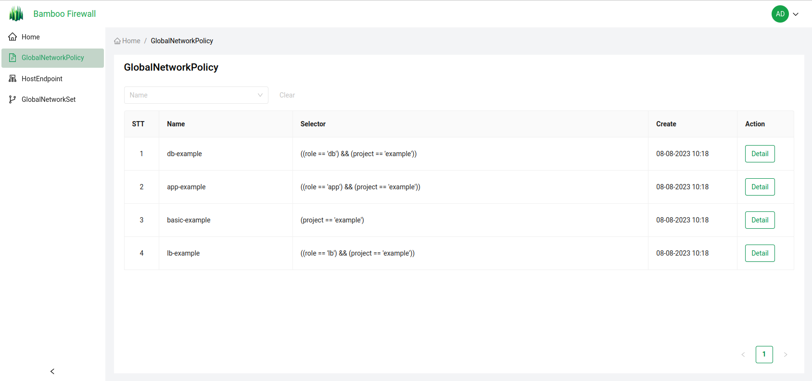
</p>

<p align="center">
  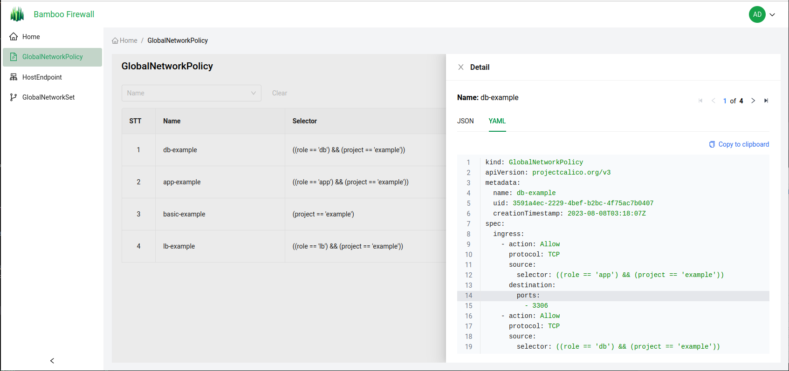
</p>

HEP
<p align="center">
  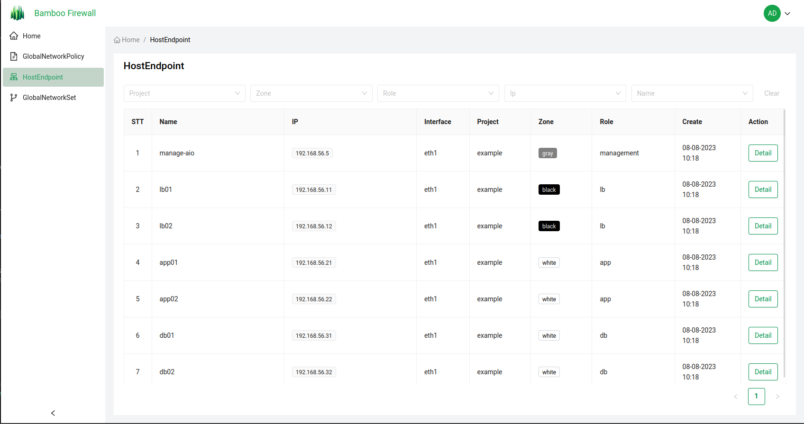
</p>

<p align="center">
  
</p>

GNS
<p align="center">
  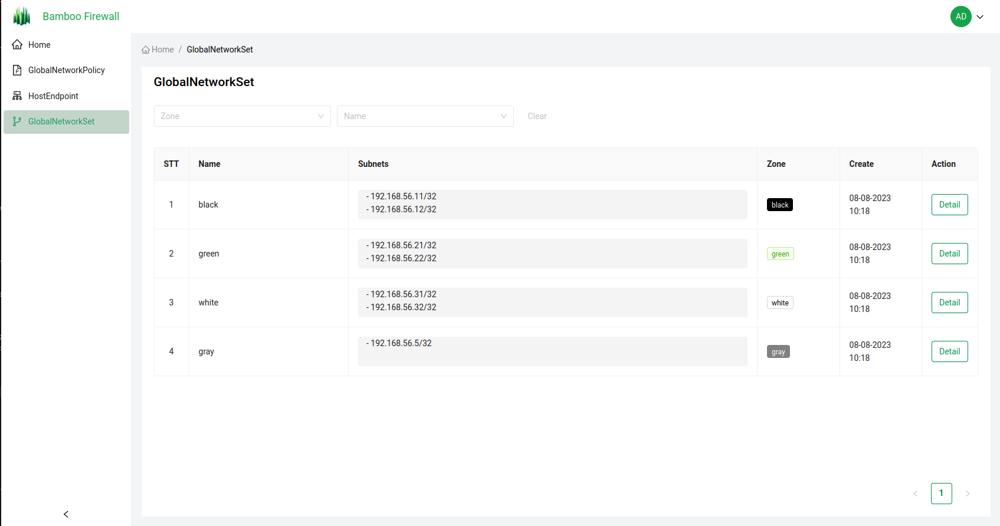
</p>

## User Acceptance Testing (UAT) Bamboo Firewall on Rocky linux 9

Repository of the Ansible playbook to install bamboo firewall on Rocky linux for manage and agent nodes: [GitHub - bamboo-firewall-v2/calico-rocky-playbook](https://github.com/bamboo-firewall-v2/calico-rocky-playbook)

### Test environment

- Test environment setup contains 3 servers, all running Rocky linux 9.

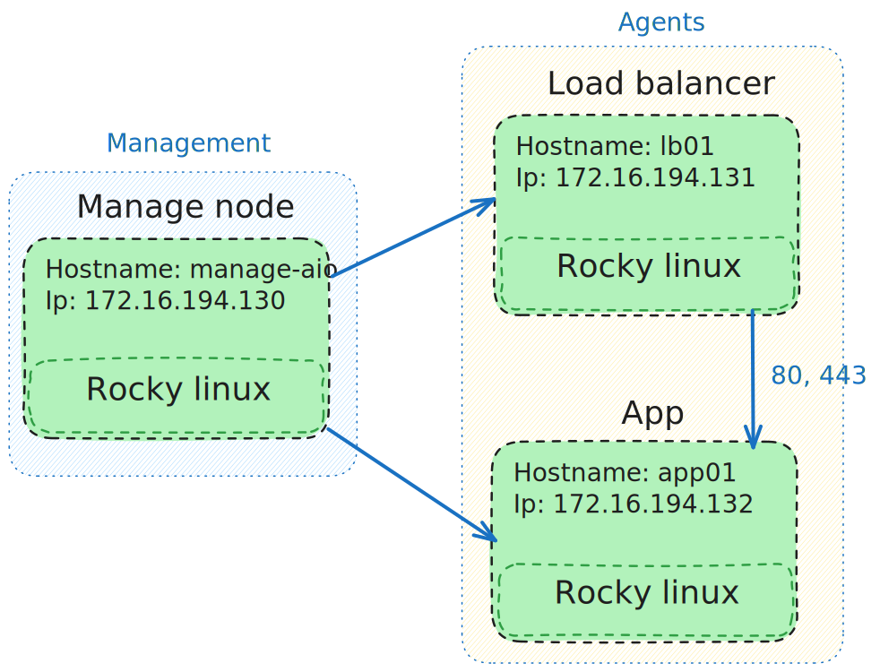

- Configuration of 3 servers:

| No |  Hostname  |       IP       | Interfaces |    Role    |  Zone | Project |  Namespace |
|:--:|:----------:|:--------------:|:----------:|:----------:|:-----:|:-------:|:----------:|
| 1  | manage-aio | 172.16.194.130 | eth1       | management | gray  | example | production |
| 2  | lb01       | 172.16.194.131 | eth1       | lb01       | white | example | production |
| 3  | app01      | 172.16.194.132 | eth1       | app01      | black | example | production |

- Policies:

| No | IP source      | Port source | IP destination | Destination port | Protocol | Description                                                  |   |
|----|----------------|-------------|----------------|------------------|----------|--------------------------------------------------------------|---|
| 1  | any            | any         | any            | 22               | TCP      | Allow ssh connection to all hosts                            |   |
| 2  | 172.16.194.131 | any         | 172.16.194.132 | [80, 443]        | TCP      | Allow APP to receive HTTP & HTTPS requests from LB           |   |
| 3  | any            | any         | 172.16.194.131 | [80, 443]        | TCP      | Allow LB to receive HTTP & HTTPS requests from outside world |   |

- Bamboo Firewall frontend home

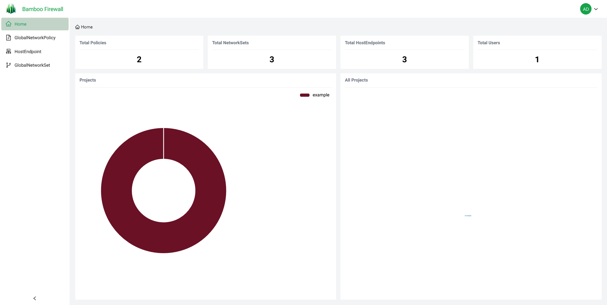

### Installation

- Ansible playbook tasks:
  - Setup hosts file
  - Update system
  - Install ipset, calico-felix (all hosts)
  - For management hosts
    - Install docker, docker-compose
    - Create config directories and files
    - Copy default schema fille
    - Run docker compose
  
### Apply policies

- GNP
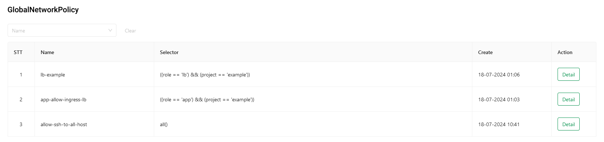

- HEP
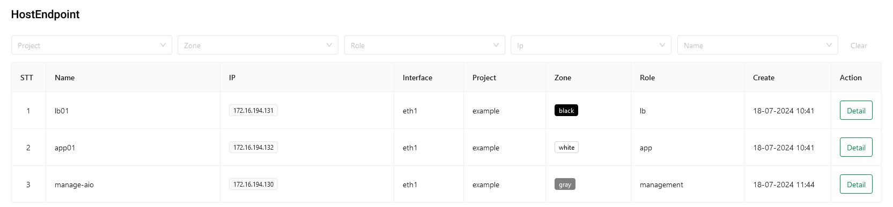

- GNS
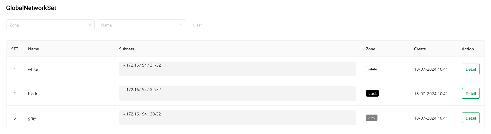

### Iptables & ipset record

- iptables records:
  - Allow http & https from anywhere access load balancer
  - Allow send http & https from load balancer to app

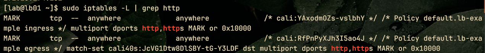

- ipset record:

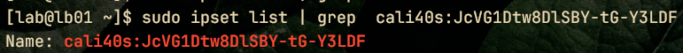
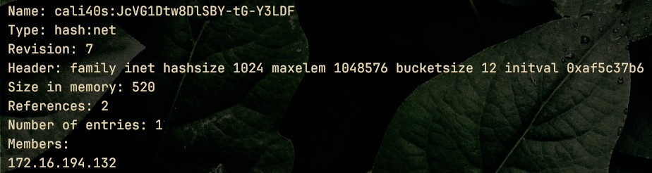

## Test mix environment between old and new calico

Release for new calico felix which is bamboo-firewall/calico merged with projectcalico/calico: [pngocthach/calico](https://github.com/pngocthach/calico/releases/tag/v0.0.2)

### Test environment 1: 3 servers

- calicoctl: v3.22.1

```sh
root@d0a6362e1f17:/bamboofw# calicoctl version
Client Version:    v3.22.1
Git commit:        82e7ce520
Cluster Version:   unknown
Cluster Type:      unknown
```

- manage-aio/lb01: v3.22.2-1-g6b085ff66917

```sh
# manage-aio
[INFO][26305] felix/usagerep.go 205: Reporting cluster usage/checking for deprecation warnings. alpEnabled=false calicoVersion="unknown" clusterGUID="0e0cb3bf0b444e508a540ecb83b35049" clusterType="unknown" gitRevision="6b085ff66917f05b5de5bcbece97c22724e18405" kubernetesVersion="unknown" stats=calc.StatsUpdate{NumHosts:3, NumWorkloadEndpoints:0, NumHostEndpoints:3, NumPolicies:3, NumProfiles:1, NumALPPolicies:0} version="v3.22.2-1-g6b085ff66917"

# lb01
[INFO][3944] felix/usagerep.go 205: Reporting cluster usage/checking for deprecation warnings. alpEnabled=false calicoVersion="unknown" clusterGUID="0e0cb3bf0b444e508a540ecb83b35049" clusterType="unknown" gitRevision="6b085ff66917f05b5de5bcbece97c22724e18405" kubernetesVersion="unknown" stats=calc.StatsUpdate{NumHosts:3, NumWorkloadEndpoints:0, NumHostEndpoints:3, NumPolicies:3, NumProfiles:1, NumALPPolicies:0} version="v3.22.2-1-g6b085ff66917"
```

- app01:
  - before: v3.22.2-1-g6b085ff66917
  - after: v3.28.0-93-gb745a727971a

```sh
gitcommit="6b085ff66917f05b5de5bcbece97c22724e18405" version="v3.22.2-1-g6b085ff66917"
```
```sh
[INFO][27868] felix/usagerep.go 205: Reporting cluster usage/checking for deprecation warnings. alpEnabled=false calicoVersion="unknown" clusterGUID="0e0cb3bf0b444e508a540ecb83b35049" clusterType="unknown" gitRevision="b745a727971a66cb9f6277090f462db93ebe2388" kubernetesVersion="unknown" stats=calc.StatsUpdate{NumHosts:3, NumWorkloadEndpoints:0, NumHostEndpoints:3, NumPolicies:3, NumProfiles:1, NumALPPolicies:0} version="v3.28.0-93-gb745a727971a"
```

### GNP

Allow load balancer access to app

```yaml
---
apiVersion: projectcalico.org/v3
kind: GlobalNetworkPolicy
metadata:
  name: app-allow-ingress-lb
spec:
  selector: ((role == 'app') && (project == 'example'))
  ingress:
    - action: Allow
      protocol: TCP
      source:
        selector: ((role == 'lb') && (project == 'example'))
      destination:
        ports: [80, 443]
```

### Before and after update comparison

- Before:

```sh
# iptables
[lab@app01 ~]$ sudo iptables -L | grep http
MARK       tcp  --  anywhere             anywhere             /* cali:C4N_hjw0Fkz9DgxN */ /* Policy default.app-allow-ingress-lb ingress */ match-set cali40s:NXoRGGB97QqUxA5rp5_5Zu0 src multiport dports http,https MARK or 0x10000

# ipset
[lab@app01 ~]$ sudo ipset list | grep cali40s:NXoRGGB97QqUxA5rp5_5Zu0 -A 10
Name: cali40s:NXoRGGB97QqUxA5rp5_5Zu0
Type: hash:net
Revision: 7
Header: family inet hashsize 1024 maxelem 1048576 bucketsize 12 initval 0x5c351cfe
Size in memory: 520
References: 1
Number of entries: 1
Members:
172.16.194.131
```

- After:

```sh
# iptables
[lab@app01 ~]$ sudo iptables -L | grep http
MARK       tcp  --  anywhere             anywhere             /* cali:C4N_hjw0Fkz9DgxN */ /* Policy default.app-allow-ingress-lb ingress */ match-set cali40s:NXoRGGB97QqUxA5rp5_5Zu0 src multiport dports http,https MARK or 0x10000

# ipset
Name: cali40s:NXoRGGB97QqUxA5rp5_5Zu0
Type: hash:net
Revision: 7
Header: family inet hashsize 1024 maxelem 1048576 bucketsize 12 initval 0x5c351cfe
Size in memory: 520
References: 1
Number of entries: 1
Members:
172.16.194.131
```

### Conclusion

- Mix environment work normally

- Pocicy details remain the same between update

### Test environment 2: 3 servers

- calicoctl: v3.22.1

```sh
root@302fa410b472:/bamboofw# calicoctl version
Client Version:    v3.28.0
Git commit:        413e6f559
Cluster Version:   unknown
Cluster Type:      unknown
```

- manage-aio/lb01: v3.22.2-1-g6b085ff66917

```sh
# manage-aio
[INFO][26305] felix/usagerep.go 205: Reporting cluster usage/checking for deprecation warnings. alpEnabled=false calicoVersion="unknown" clusterGUID="0e0cb3bf0b444e508a540ecb83b35049" clusterType="unknown" gitRevision="6b085ff66917f05b5de5bcbece97c22724e18405" kubernetesVersion="unknown" stats=calc.StatsUpdate{NumHosts:3, NumWorkloadEndpoints:0, NumHostEndpoints:3, NumPolicies:3, NumProfiles:1, NumALPPolicies:0} version="v3.22.2-1-g6b085ff66917"

# lb01
[INFO][3944] felix/usagerep.go 205: Reporting cluster usage/checking for deprecation warnings. alpEnabled=false calicoVersion="unknown" clusterGUID="0e0cb3bf0b444e508a540ecb83b35049" clusterType="unknown" gitRevision="6b085ff66917f05b5de5bcbece97c22724e18405" kubernetesVersion="unknown" stats=calc.StatsUpdate{NumHosts:3, NumWorkloadEndpoints:0, NumHostEndpoints:3, NumPolicies:3, NumProfiles:1, NumALPPolicies:0} version="v3.22.2-1-g6b085ff66917"
```

- app01:
  - before: v3.22.2-1-g6b085ff66917
  - after: v3.28.0-93-gb745a727971a

```sh
gitcommit="6b085ff66917f05b5de5bcbece97c22724e18405" version="v3.22.2-1-g6b085ff66917"
```

```sh
[INFO][27868] felix/usagerep.go 205: Reporting cluster usage/checking for deprecation warnings. alpEnabled=false calicoVersion="unknown" clusterGUID="0e0cb3bf0b444e508a540ecb83b35049" clusterType="unknown" gitRevision="b745a727971a66cb9f6277090f462db93ebe2388" kubernetesVersion="unknown" stats=calc.StatsUpdate{NumHosts:3, NumWorkloadEndpoints:0, NumHostEndpoints:3, NumPolicies:3, NumProfiles:1, NumALPPolicies:0} version="v3.28.0-93-gb745a727971a"
```

### Conclusion

- Mix environment work normally

- Pocicy details remain the same between update

# Resouces used

<p align="center">
  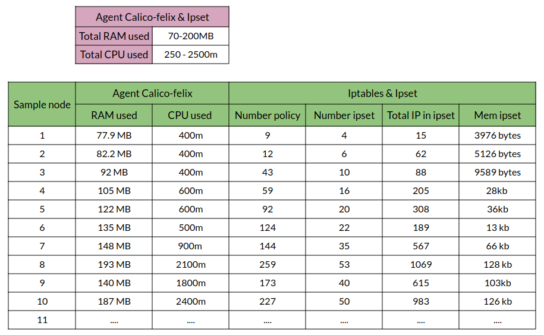
</p>

# Development roadmap

- Support multiOS 
<p align="center">
  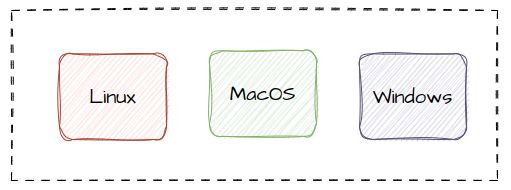
</p>

- Define policy on GUI 
<p align="center">
  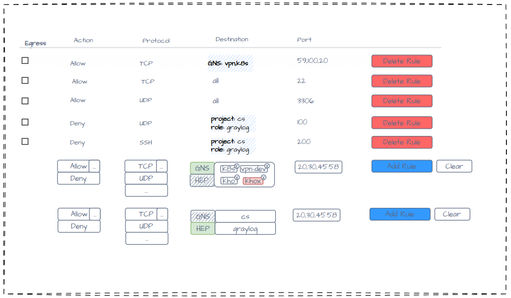
</p>

- View policy between servers/groups as a diagram
<p align="center">
  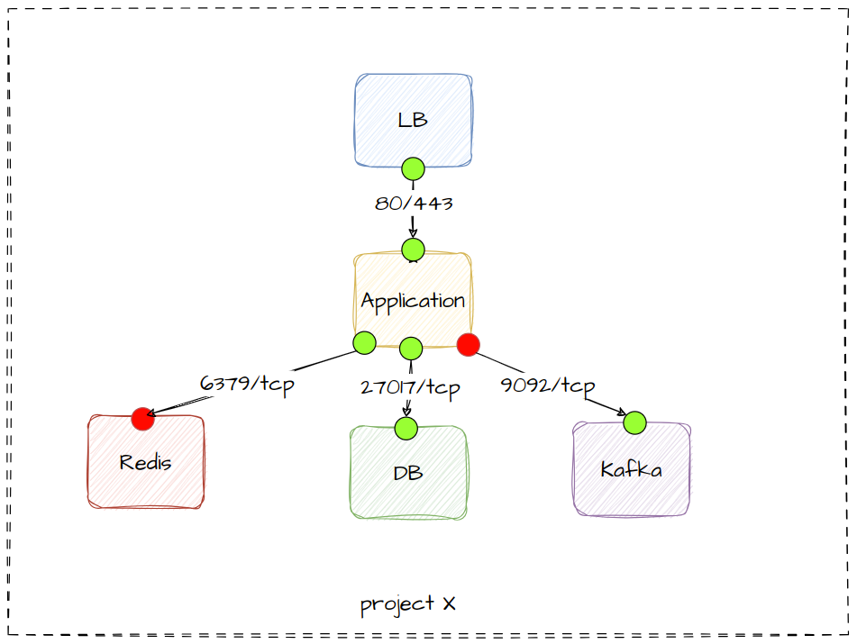
</p>

# About us

- [bienkma](https://bienkma.github.io) - Founder
- [anhcx0209](https://github.com/anhcx0209) - Backend engineer (Co-Founder)
- [uncelvel](https://github.com/uncelvel) - Designer (Co-Founder)
- [x3vuduclong](https://github.com/x3vuduclong) - Frontend engineer (Co-Founder)
- [D4r1inG](https://github.com/D4r1inG) - Frontend engineer (Co-Founder)

# License

Bamboo Firewall is under the Apache 2.0 license. See the LICENSE file for details.

