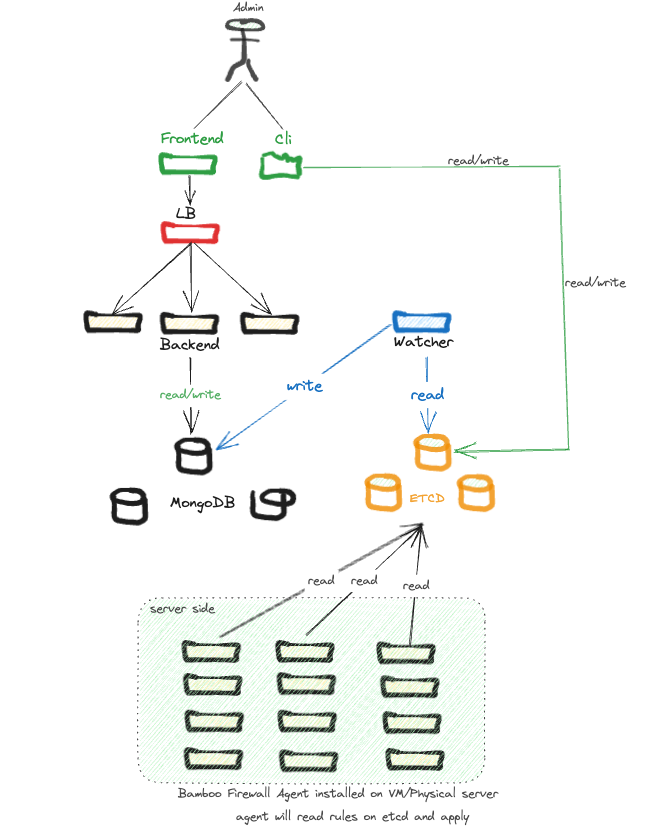

# Table of contents

- [What is Bamboo Firewall?](#What-is-Bamboo-Firewall?)
- [Community](#Community)
- [Case studies](#Case-studies)
- [Architecture](#Architecture)
- [License](#License)

# What is Bamboo Firewall?

Bamboo Firewall is an opensource software firewall that supports network segmentation, Central management and
rules/polices as code. It is a host base firewall, so the policy is very strict. Unlike traditional firewalls, it
provides many functions for centralized policy setting as tag, label, range, annotations...

# Community

You can join the following groups or channels to discuss or ask questions about Bamboo Firewall, and to keep yourself
informed of the latest Bamboo Firewall updates:

- Seek help when you use TiDB
    - Slack
      channels: [#everyone (Vietnamese, English)](https://join.slack.com/t/bamboo-firewall/shared_invite/zt-207jwcvcl-tIXUfYBKoe6TNPcce6iqXw)

# Case studies

- [Bamboo Firewall at GHTK](./case-studies/ghtk.md)

# Architecture



- etcd cluster: Where stores metadata of bamboo firewall. ex: server endpoint, network zone, policies
- backend (be): API backend server. It provides API for frontend
- frontend (fe): Frontend provides user interfaces via webview
- cli: Command line provides console interface for administrator
- Agent: Agent installed each server and connect to etcd cluster to apply policies
- watcher: A job watch events from etcd to mongodb database (one way)

# How to installation

- Step 1: Install etcd cluster
- Step 2: Install MongoDB (stand-alone or replication)
- step 3: Install frontend, watcher and backend
- step 4: Install agent to server which you want to apply polices and rules of firewall
- step 5: write rules as code then apply to bamboo firewall

For example: We have 7 servers below

| No  | HOSTNAME   | IPADDR         | INTERFACES | ROLE       | ZONE | PROJECT | NAMESPCE |
|-----|------------|----------------|------------|------------|----------|---------|----------|
| 1   | db[01-02]  | 10.110.1.[1-2] | eth01      | db         | white|  example  |  production |
| 2   | app[01-02] | 10.110.2.[1-2] | eth01      | app        | green|  example  |  production |
| 3   | lb[01-02]  | 10.110.3.[1-2] | eth01      | lb         | black|   example |  production |
| 4   | admin01    | 10.110.8.1     | eth01      | management | gray|   example  |  production |


| No  | IP SRC              | PORT SRC | IP DST              | PORT DST | PROTO   | Details         |
|-----|---------------------|----------|---------------------|----------|---------|-----------------|
| 1   | 10.110.2.[1-2]      | any      | 10.110.1.[1-2]      | 3306     | TCP     | APP to DB       |
| 2   | any                 | any      | 10.110.3.[1-2]      | 443,80   | TCP     | Public Internet |
| 3   | 10.110.3.[1-2]      | any      | 10.110.2.[1-2]      | 80,443   | TCP     | LB to APP       |
| 4   | all-example-servers | any      | any                 | 123,53   | UDP/TCP | DNS and NTP     |
| 5   | 10.110.8.1          | any      | all-example-servers | any      | UDP/TCP | Management      |

- [make a folder to store code](./demo/bbfw):

```shell
mkdir bbfw bbfw/hep bbfw/gns bbfw/gnp
```

- create hostEndpoint

```shell
cd bbfw/hep
cat <<EOF >>10.110.1.1-eth0.yaml
apiVersion: projectcalico.org/v3
kind: HostEndpoint
metadata:
  name: 10.110.1.1
  labels:
    role: db
    zone: white
    namespace: production
    project: example
    ip: 10.110.1.1
spec:
  node: db01
  interfaceName: eth0
  expectedIPs: ["10.110.1.1"]
EOF

cat <<EOF >>10.110.1.2-eth0.yaml
apiVersion: projectcalico.org/v3
kind: HostEndpoint
metadata:
  name: 10.110.1.2
  labels:
    role: db
    zone: white
    namespace: production
    project: example
    ip: 10.110.1.2
spec:
  node: db02
  interfaceName: eth0
  expectedIPs: ["10.110.1.2"]
EOF

cat <<EOF >>10.110.2.1-eth0.yaml
apiVersion: projectcalico.org/v3
kind: HostEndpoint
metadata:
  name: 10.110.2.1
  labels:
    role: app
    zone: white
    namespace: production
    project: example
    ip: 10.110.2.1
spec:
  node: app01
  interfaceName: eth0
  expectedIPs: ["10.110.2.1"]
EOF

cat <<EOF >>10.110.2.2-eth0.yaml
apiVersion: projectcalico.org/v3
kind: HostEndpoint
metadata:
  name: 10.110.2.2
  labels:
    role: app
    zone: white
    namespace: production
    project: example
    ip: 10.110.2.2
spec:
  node: app02
  interfaceName: eth0
  expectedIPs: ["10.110.2.2"]
EOF

cat <<EOF >>10.110.3.1-eth0.yaml
apiVersion: projectcalico.org/v3
kind: HostEndpoint
metadata:
  name: 10.110.3.1
  labels:
    role: lb
    zone: black
    namespace: production
    project: example
    ip: 10.110.3.1
spec:
  node: lb01
  interfaceName: eth0
  expectedIPs: ["10.110.3.1"]
EOF

cat <<EOF >>10.110.3.2-eth0.yaml
apiVersion: projectcalico.org/v3
kind: HostEndpoint
metadata:
  name: 10.110.3.2
  labels:
    role: lb
    zone: black
    namespace: production
    project: example
    ip: 10.110.3.2
spec:
  node: lb02
  interfaceName: eth0
  expectedIPs: ["10.110.3.2"]
EOF

cat <<EOF >>10.110.8.1-eth0.yaml
apiVersion: projectcalico.org/v3
kind: HostEndpoint
metadata:
  name: 10.110.8.1
  labels:
    role: management
    zone: gray
    namespace: production
    project: example
    ip: 10.110.8.1
spec:
  node: admin01
  interfaceName: eth0
  expectedIPs: ["10.110.8.1"]
EOF
```

- create zones
```shell
cat <<EOF >>gray.yaml
apiVersion: projectcalico.org/v3
kind: GlobalNetworkSet
metadata:
  name: gray
  labels:
    zone: gray
    name: gray
spec:
  nets:
    - 10.110.8.0/24
EOF

cat <<EOF >>white.yaml
apiVersion: projectcalico.org/v3
kind: GlobalNetworkSet
metadata:
  name: white
  labels:
    zone: white
    name: white
spec:
  nets:
    - 10.110.1.0/24
EOF

cat <<EOF >>green.yaml
apiVersion: projectcalico.org/v3
kind: GlobalNetworkSet
metadata:
  name: green
  labels:
    zone: green
    name: green
spec:
  nets:
    - 10.110.2.0/24
EOF

cat <<EOF >>black.yaml
apiVersion: projectcalico.org/v3
kind: GlobalNetworkSet
metadata:
  name: black
  labels:
    zone: black
    name: black
spec:
  nets:
    - 10.110.3.0/24
EOF
```
- create polices
```shell
cat <<EOF >>db-example.yaml
apiVersion: projectcalico.org/v3
kind: GlobalNetworkPolicy
metadata:
  name: 'db-example'
spec:
  selector: ((role == 'db') && (project == 'example'))
  ingress:
    - action: Allow
      protocol: TCP
      source:
        selector: ((role == 'app') && (project == 'example'))
      destination:
        ports: [3306]
    - action: Allow
      protocol: TCP
      source:
        selector: ((role == 'db') && (project == 'example'))
      destination:
        ports: [3306]      
  egress:
    - action: Allow
      protocol: TCP
      source:
        selector: ((role == 'db') && (project == 'example'))
      destination:
        selector: ((role == 'db') && (project == 'example'))
        ports: [3306]
EOF

cat <<EOF >>lb-example.yaml
apiVersion: projectcalico.org/v3
kind: GlobalNetworkPolicy
metadata:
  name: 'lb-example'
spec:
  selector: ((role == 'lb') && (project == 'example'))
  ingress:
    - action: Allow
      protocol: TCP
      destination:
        ports: [80,443]    
  egress:
    - action: Allow
      protocol: TCP
      destination:
        selector: ((role == 'app') && (project == 'example'))
        ports: [80,443]
EOF

cat <<EOF >>app-example.yaml
apiVersion: projectcalico.org/v3
kind: GlobalNetworkPolicy
metadata:
  name: 'app-example'
spec:
  selector: ((role == 'app') && (project == 'example'))
  ingress:
    - action: Allow
      protocol: TCP
      source:
        selector: ((role == 'lb') && (project == 'example'))
      destination:
        ports: [80,443]    
  egress:
    - action: Allow
      protocol: TCP
      destination:
        selector: ((role == 'db') && (project == 'example'))
        ports: [3306]
EOF

cat <<EOF >>basic-example.yaml
apiVersion: projectcalico.org/v3
kind: GlobalNetworkPolicy
metadata:
  name: 'basic-example'
spec:
  selector: (project == 'example')) 
  egress:
    - action: Allow
      protocol: TCP
      source:
        selector: (project == 'example'))
      destination:
        selector: (project == 'example'))
        ports: [53,123]
    - action: Allow
      protocol: UDP
      source:
        selector: (project == 'example'))
      destination:
        selector: (project == 'example'))
        ports: [53,123]
EOF
```
- Apply policies to endpoints
```shell
calicoctl apply -f [FILE_NAME].yaml
```
- Check hostEndpoint and Policies
```shell
calicoctl get hep
calicoctl get gns
calicoctl get gnp
```
And view on your webview
# About us

- [bienkma](https://bienkma.github.io) - Founder
- [anhcx0209](https://github.com/anhcx0209) - Backend engineer (Co-Founder)
- [uncelvel](https://github.com/uncelvel) - Designer (Co-Founder)
- [x3vuduclong](https://github.com/x3vuduclong) - Frontend engineer (Co-Founder)
- [D4r1inG](https://github.com/D4r1inG) - Frontend engineer (Co-Founder)

# License

Bamboo Firewall is under the Apache 2.0 license. See the LICENSE file for details.

