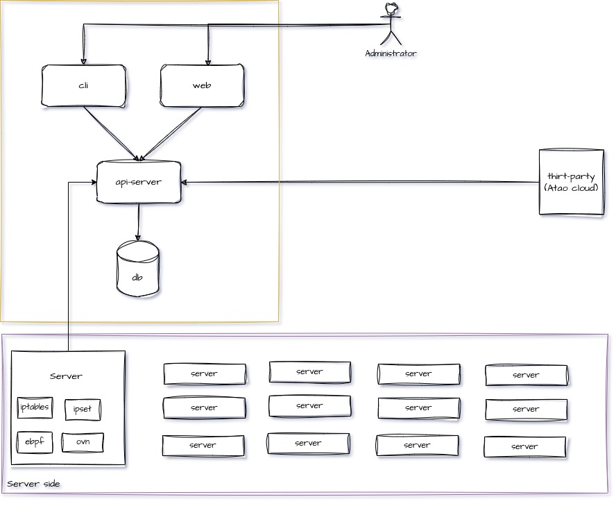

# Bamboo Policy Architecture

Trinh Dinh Bien
Head of Infra department
bienkma@ghtk.co
https://bienkma.github.io

## About Bamboo-policy
### What is Bamboo-policy
**Bamboo-policy** is open source software for a networking and security solution that enables **ATAO-Cloud** workloads and non-ATAO-Cloud

## Architecture

## Components and features

### Components
| Component               | Description                              | Main feature                                                                                                                                |
|-------------------------|------------------------------------------|---------------------------------------------------------------------------------------------------------------------------------------------|
| bamboo-api-server(zeus) | Contain policy for DataPlain to execute. | Handle request from User or bambooctl. Connect to DataStore. Handle logic policy to allow/deny traffic within a node, between nodes. |
| bamboo-cni(hercules)    | Apply policy to DataPlain                | Connect to DataPlains: eBPF, standard Linux iptables(iptables, nftables), ipset. Apply policy to DataPlains.                             |

### Feature summary
| Feature         | Description                                              |
|-----------------|----------------------------------------------------------|
| DataPlanes      | eBPF, standard Linux iptables(iptables, nftables), ipset |
| User interfaces | bamboctl                                                 |

## API-Server(Zeus)
Handle request from administrator. Run between the datastore and instance of bamboo-cni. Classify policies for each host endpoints.

## Bamboo-cni(Hercules)
Programs routes and ACLs on the host to provide desired connectivity for the endpoints on that host. Run on each machine that hosts endpoints. Run as an agent daemon

- **ACL programming** 
   Programs ACLs into the Linux Kernel to ensure that only valid traffic can be sent between endpoints, and that endpoints cannot circumvent Bamboo security measures.

## Data Store
**MongoDB** persistent data from administrator

## bamboctl
Command line interface to create, read, update and delete objects.