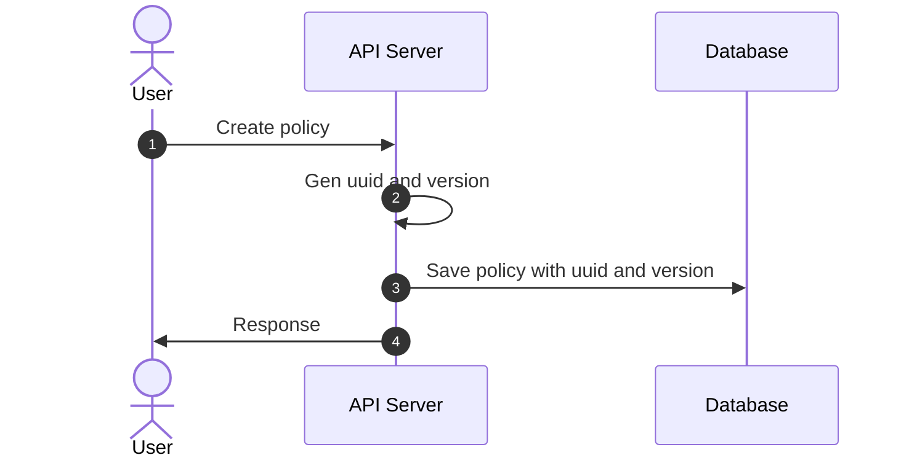
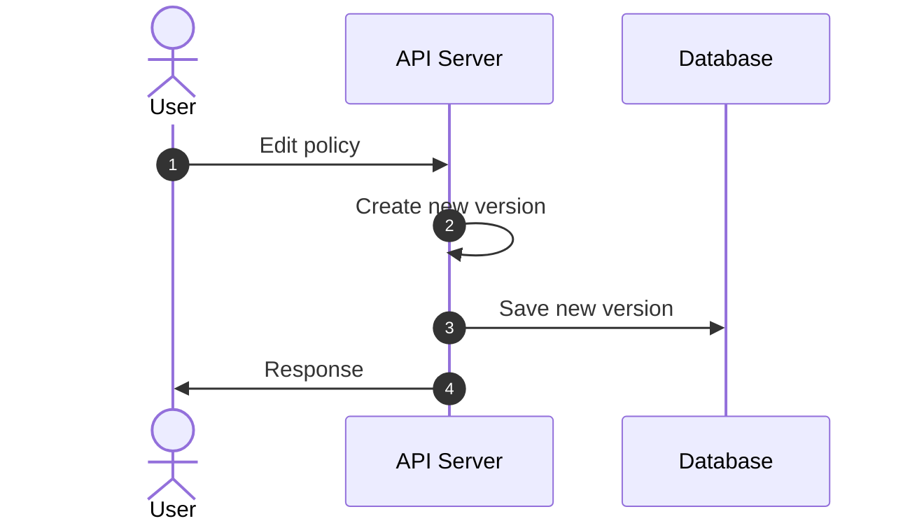
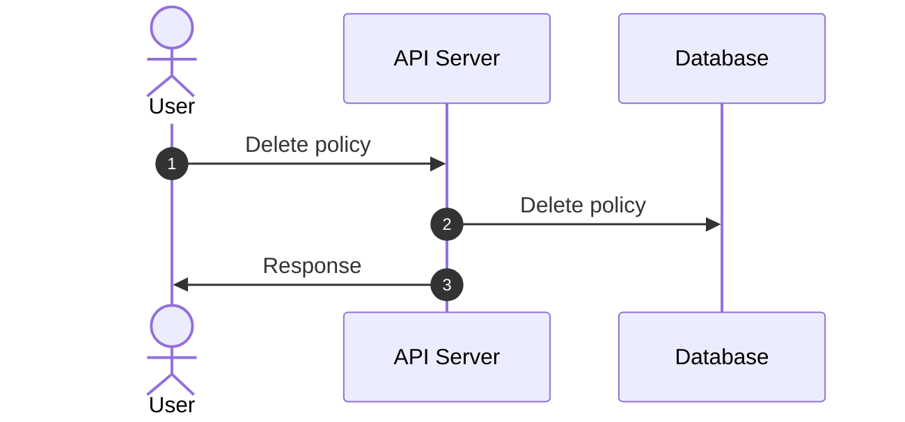
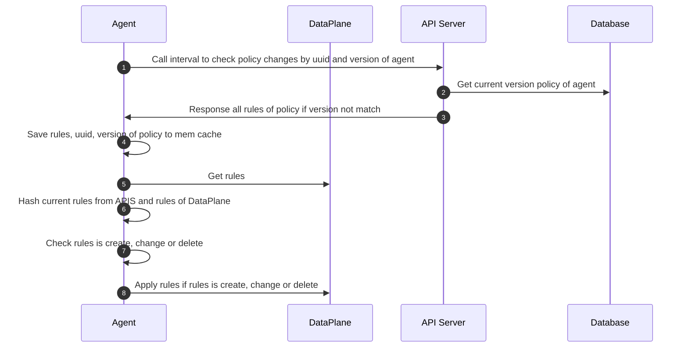
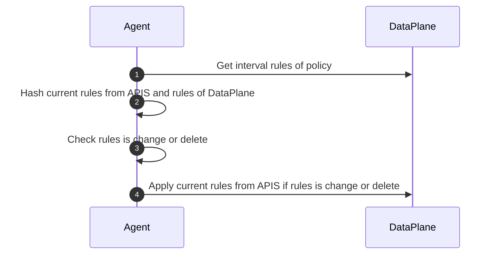

# Flow with policy

## Create from User


## Edit from User


## Delete from User


### Call interval from Agent to API-Server


### Interval check rules changes from DataPlane in Agent


## hash rule
```text
sha224(rule) -> hash
```

## API
### Input(json)

## CLI
### Input(json or yaml)

## Input Host Endpoint(json or yaml)
- represents one or more real or virtual interfaces attached to a host that is running bamboo-policy

```json
{
  "metadata": {
    "name": "",
    "labels": {}
  },
  "spec": {
    "interfaceName": "",
    "ips": [
      ""
    ]
  },
  "description": ""
}
```

```yaml
metadata:
  name: ''
  labels: {}
spec:
  interfaceName: ''
  ips:
  - ''
description: ''
```

Definition

| Field       | Mandatory | Accepted Values | Schema                             | Description                           | Default value |
|-------------|-----------|-----------------|------------------------------------|---------------------------------------|---------------|
| metadata    | TRUE      |                 | [Metadata](#hostendpoint-metadata) | Metadata of host endpoint             |               |
| spec        | TRUE      |                 | [Spec](#hostendpoint-spec)         | Specific information of host endpoint |               |
| description | FALSE     |                 | string                             | Description                           |               |

<a id="hostendpoint-metadata">**Metadata**</a>

| Field  | Mandatory | Accepted Values | Schema               | Description                                               | Default value |
|--------|-----------|-----------------|----------------------|-----------------------------------------------------------|---------------|
| name   | TRUE      |                 | string               | name of host endpoint                                     |               |
| labels | TRUE      |                 | map[string]interface | used to validate the policy assigned to the host endpoint |               |

<a id="hostendpoint-spec">**Spec**</a>

| Field         | Mandatory | Accepted Values | Schema        | Description                                                 | Default value |
|---------------|-----------|-----------------|---------------|-------------------------------------------------------------|---------------|
| interfaceName | TRUE      |                 | string        | The name of the specific interface on which to apply policy |               |
| ips           | TRUE      |                 | array string  | list ips of host endpoint                                   |               |

## Input Global Network Set(json or yaml)

- represents an arbitrary set of IP subnetworks/CIDRs, allowing it to be matched by rule in Global network Policy

```json
{
  "metadata": {
    "name": "",
    "labels": {}
  },
  "spec": {
    "nets": [
      ""
    ]
  },
  "description": ""
}
```

```yaml
metadata:
  name: ''
  labels: {}
spec:
  nets:
  - ''
description: ''
```

Definition

| Field       | Mandatory | Accepted Values | Schema                                 | Description                                | Default value |
|-------------|-----------|-----------------|----------------------------------------|--------------------------------------------|---------------|
| metadata    | TRUE      |                 | [Metadata](#globalNetworkSet-metadata) | Metadata of global network set             |               |
| spec        | TRUE      |                 | [Spec](#globalNetworkSet-spec)         | Specific information of global network set |               |
| description | FALSE     |                 | string                                 | Description                                |               |

<a id="globalNetworkSet-metadata">**Metadata**</a>

| Field  | Mandatory | Accepted Values | Schema               | Description                                                            | Default value |
|--------|-----------|-----------------|----------------------|------------------------------------------------------------------------|---------------|
| name   | TRUE      |                 | string               | name of set                                                            |               |
| labels | TRUE      |                 | map[string]interface | used to validate the rule of policy assigned to the global network set |               |

<a id="globalNetworkSet-spec">**Spec**</a>

| Field | Mandatory | Accepted Values | Schema       | Description      | Default value |
|-------|-----------|-----------------|--------------|------------------|---------------|
| nets  | TRUE      |                 | array string | list ips or cidr |               |

## Input Global Network policy(json or yaml)

- represents an ordered set of rules which are applied to a collection of endpoint

```json
{
  "metadata": {
    "name": "",
    "labels": {}
  },
  "description": "",
  "spec": {
    "selector": "",
    "ingress": {
      "metadata": {},
      "action": "",
      "protocol": "",
      "notProtocol": "",
      "ipVersion": 0,
      "source": {
        "selector": "",
        "nets": [""],
        "notNets": [""],
        "ports": [],
        "notPorts": []
      },
      "destination": {
        "selector": "",
        "nets": [""],
        "notNets": [""],
        "ports": [],
        "notPorts": []
      }
    },
    "egress": {
      "metadata": {},
      "action": "",
      "protocol": "",
      "notProtocol": "",
      "ipVersion": 0,
      "source": {
        "selector": "",
        "nets": [""],
        "notNets": [""],
        "ports": [],
        "notPorts": []
      },
      "destination": {
        "selector": "",
        "nets": [""],
        "notNets": [""],
        "ports": [],
        "notPorts": []
      }
    }
  }
}
```

```yaml
metadata:
  name: ''
  labels: {}
description: ''
spec:
  selector: ''
  ingress:
    metadata: {}
    action: ''
    protocol: ''
    notProtocol: ''
    ipVersion: 0
    source:
      selector: ''
      nets:
      - ''
      notNets:
      - ''
      ports: []
      notPorts: []
    destination:
      selector: ''
      nets:
      - ''
      notNets:
      - ''
      ports: []
      notPorts: []
  egress:
    metadata: {}
    action: ''
    protocol: ''
    notProtocol: ''
    ipVersion: 0
    source:
      selector: ''
      nets:
      - ''
      notNets:
      - ''
      ports: []
      notPorts: []
    destination:
      selector: ''
      nets:
      - ''
      notNets:
      - ''
      ports: []
      notPorts: []
```

Definition

| Field       | Mandatory | Accepted Values | Schema                       | Description                    | Default value |
|-------------|-----------|-----------------|------------------------------|--------------------------------|---------------|
| metadata    | TRUE      |                 | [Metadata](#policy-metadata) | Metadata of policy             |               |
| spec        | TRUE      |                 | [Spec](#policy-spec)         | Specific information of policy |               |
| description | FALSE     |                 | string                       | Description                    |               |

<a id="policy-metadata">**Metadata**</a>

| Field  | Mandatory | Accepted Values | Schema               | Description      | Default value |
|--------|-----------|-----------------|----------------------|------------------|---------------|
| name   | TRUE      |                 | string               | Name of policy   |               |
| labels | TRUE      |                 | map[string]interface | label for policy |               |

<a id="policy-spec">**Spec**</a>

| Field    | Mandatory | Accepted Values | Schema        | Description                                       | Default value |
|----------|-----------|-----------------|---------------|---------------------------------------------------|---------------|
| selector | FALSE     |                 | string        | Selects the endpoint to which this policy applies |               |
| ingress  | FALSE     |                 | [Rule](#rule) | Ordered list of ingress rules applied by policy   |               |
| egress   | FALSE     |                 | [Rule](#rule) | Ordered list of egress rules applied by policy    |               |

<a id="rule">**Rule**</a>

| Field       | Mandatory | Accepted Values                | Schema                     | Description                                          | Default value |
|-------------|-----------|--------------------------------|----------------------------|------------------------------------------------------|---------------|
| metadata    | FALSE     |                                | map[string]interface       |                                                      |               |
| action      | TRUE      | `Allow`, `Deny`, `Log`, `Pass` | string                     | Action to perform when matching this rule            |               |
| protocol    | FALSE     | `TCP`, `UDP`, `SCTP`, `ICMP`   | string                     | positive protocol match(cannot use with notProtocol) |               |
| notProtocol | FALSE     | `TCP`, `UDP`, `SCTP`, `ICMP`   | string                     | negative protocol match(cannot use with protocol)    |               |
| ipVersion   | TRUE      | `4`, `6`                       | number                     | ip version                                           |               |
| source      | FALSE     |                                | [EntityRule](#entity_rule) | Source match parameter                               |               |
| destination | FALSE     |                                | [EntityRule](#entity_rule) | Destination match parameter                          |               |

<a id="entity_rule">**EntityRule**</a>

| Field    | Mandatory | Accepted Values | Schema        | Description                                                                      | Default value |
|----------|-----------|-----------------|---------------|----------------------------------------------------------------------------------|---------------|
| selector | FALSE     |                 | string        | Selects the host endpoint, global network set to which this rule                 |               |
| nets     | FALSE     |                 | list of CIDRs | Match packets with positive IP in any of the list CIDRs(cannot use with notNets) |               |
| notNets  | FALSE     |                 | list of CIDRs | Match packets with negative IP in any of the list CIDRs(cannot use with nets)    |               |
| ports    | FALSE     |                 | string        | Positive match on the specified(cannot use with notPorts) [ports](#ports)        |               |
| notPorts | FALSE     |                 | string        | Negative match on the specified(cannot use with ports) [ports](#ports)           |               |

<a id="ports">**Ports**</a>

| Syntax    | Example    | Description                                                         |
|-----------|------------|---------------------------------------------------------------------|
| int       | 80         | The exact (numeric) port specified                                  |
| start:end | 1001:1010  | All numeric ports within the range start <= x <= end                |
