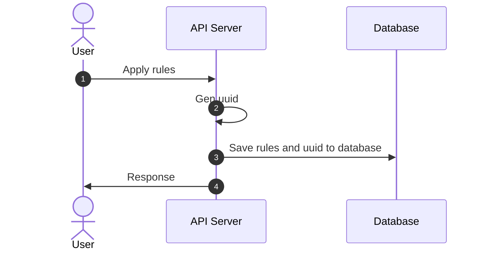
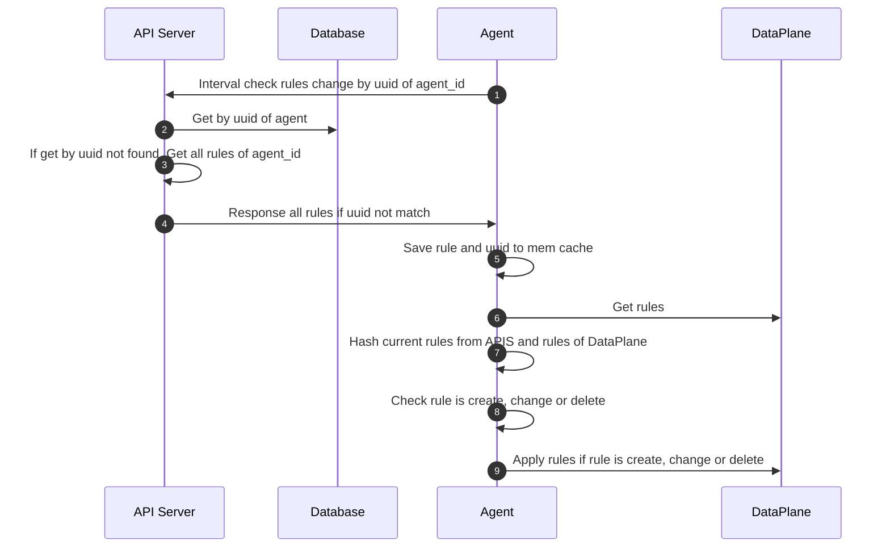
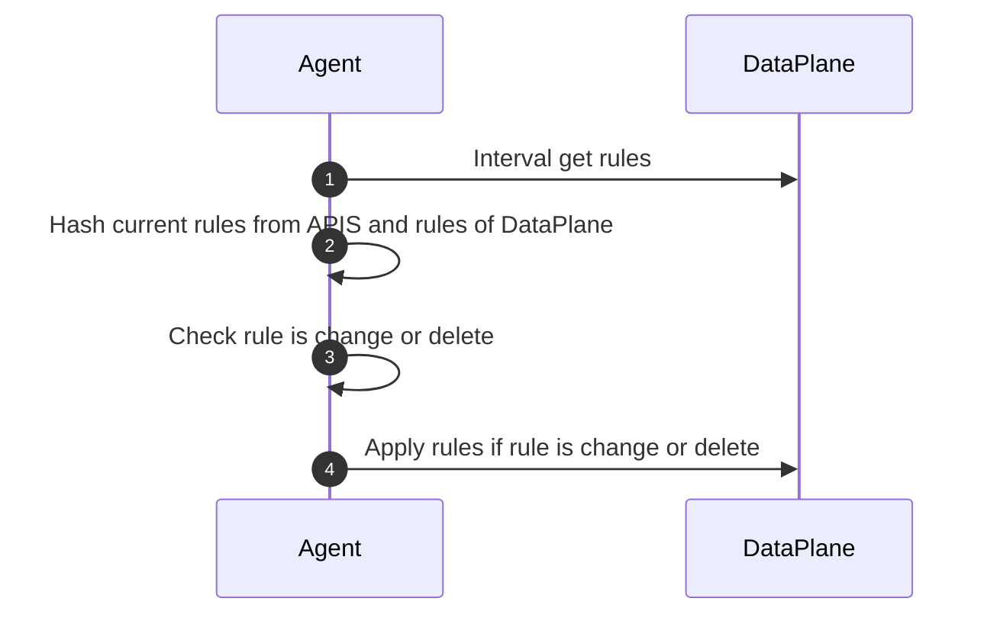
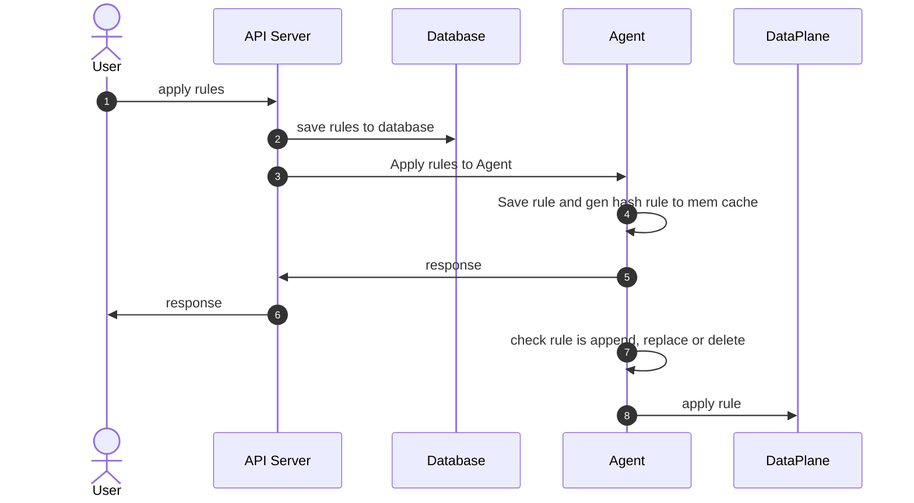
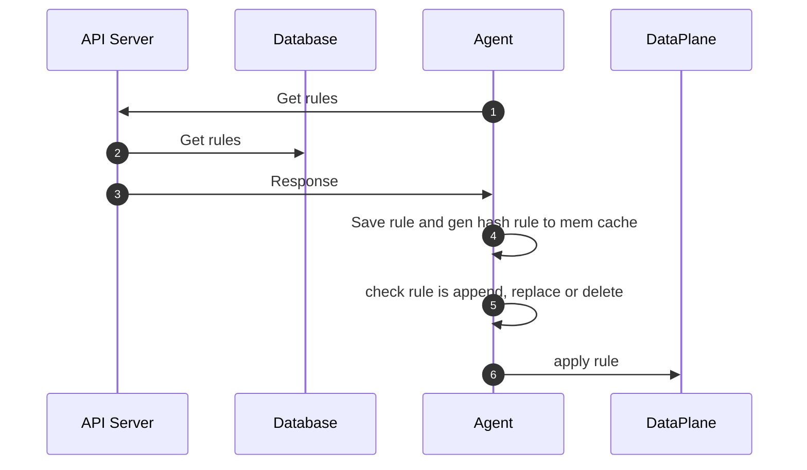

# Flow Apply rules

## Agent --> API-Server

### Apply rule from User



### Call interval from Agent to API-Server



### Interval check change rule from DataPlane in Agent



## API-Server <---> Agent

### Flow apply rule from API server



### Interval check change rule from DataPlane in Agent


### Flow agent start or restart



## APIS <---> Agent(keep connection)

### Flow apply rule from API server


### Interval check change rule from DataPlane in Agent


## hash rule
```
sha224(rule) -> hash
```

## DataPlane
### ipset
### iptables
### nftables
### ebpf

## Input Host Endpoint
- represents one or more real or virtual interfaces attached to a host that is running atao-policy
```json
{
  "host_name": "",
  "interface_name": "",
  "ips": [""],
  "ports": [
    {
      "name": "",
      "port": 0,
      "protocol": ""
    }
  ],
  "description": ""
}
```

Definition

| Field          | Mandatory | Accepted Values | Schema        | Description                                                 | Default value |
|----------------|-----------|-----------------|---------------|-------------------------------------------------------------|---------------|
| host_name      | TRUE      |                 | string        | Name of host                                                |               |
| interface_name | TRUE      |                 | string        | The name of the specific interface on which to apply policy |               |
| ips            | TRUE      |                 | array string  | ips                                                         |               |
| ports          | TRUE      |                 | [Port](#port) | List of named ports that this workload exposes              |               |
| description    | FALSE     |                 | string        | Description                                                 |               |

<a id="port">Port</a>

| Field       | Mandatory | Accepted Values      | Schema  | Description                     | Default value |
|-------------|-----------|----------------------|---------|---------------------------------|---------------|
| name        | TRUE      |                      | string  | The name attach to this port    |               |
| protocol    | TRUE      | `TCP`, `UDP`, `SCTP` | String  | The protocol of this named port |               |
| port        | TRUE      | `1` - `65535`        | integer | The workload port number        |               |

## Input policy

- represents an ordered set of rules which are applied to a collection of endpoint

```json
{
  "policy_name": "",
  "project_id": 0,
  "tenant_id": 0,
  "description": "",
  "spec": {
    "selector": "",
    "types": [""],
    "ingress": {
      "metadata": {},
      "action": "",
      "protocol": "",
      "source": {
        "nets": [""],
        "ports": []
      },
      "destination": {
        "nets": [""],
        "ports": []
      }
    },
    "egress": {
      "metadata": {},
      "action": "",
      "protocol": "",
      "source": {
        "nets": [""],
        "ports": []
      },
      "destination": {
        "nets": [""],
        "ports": []
      }
    }
  }
}
```

Definition

| Field       | Mandatory | Accepted Values | Schema  | Description    | Default value |
|-------------|-----------|-----------------|---------|----------------|---------------|
| policy_name | TRUE      |                 | string  | Name of policy |               |
| project_id  | FALSE     |                 | integer | Project ID     |               |
| tenant_id   | FALSE     |                 | integer | Tenant ID      |               |
| description | FALSE     |                 | string  | Description    |               |

Spec

| Field    | Mandatory | Accepted Values     | Schema       | Description                                              | Default value |
|----------|-----------|---------------------|--------------|----------------------------------------------------------|---------------|
| selector | TRUE      |                     | string       | Selects the endpoint to which this policy applies        | all()         |
| types    | TRUE      | `Ingress`, `Egress` | array string | Applies the policy based on the direction of the traffic |               |
| ingress  | FALSE     |                     | Rule         | Ordered list of ingress rules applied by policy          |               |
| egress   | FALSE     |                     | Rule         | Ordered list of egress rules applied by policy           |               |

Rule

| Field       | Mandatory | Accepted Values                | Schema               | Description                               | Default value |
|-------------|-----------|--------------------------------|----------------------|-------------------------------------------|---------------|
| metadata    | FALSE     |                                | map of string string |                                           |               |
| action      | TRUE      | `Allow`, `Deny`, `Log`, `Pass` | string               | Action to perform when matching this rule |               |
| protocol    | TRUE      | `TCP`, `UDP`, `SCTP`, `ICMP`   | string               | positive protocol match                   |               |
| source      | FALSE     |                                | EntityRule           | Source match parameter                    |               |
| destination | FALSE     |                                | EntityRule           | Destination match parameter               |               |

EntityRule

| Field | Mandatory | Accepted Values | Schema        | Description                                    | Default value |
|-------|-----------|-----------------|---------------|------------------------------------------------|---------------|
| nets  | FALSE     |                 | list of CIDRs | Match packets with IP in any of the list CIDRs |               |
| ports | FALSE     |                 | string        | Positive match on the specified ports          |               |


Ports

| Syntax    | Example    | Description                                                         |
|-----------|------------|---------------------------------------------------------------------|
| int       | 80         | The exact (numeric) port specified                                  |
| start:end | 1001:1010  | All numeric ports within the range start <= x <= end                |
| string    | named-port | A named port, as defined in the ports list of one or mores endpoint |

