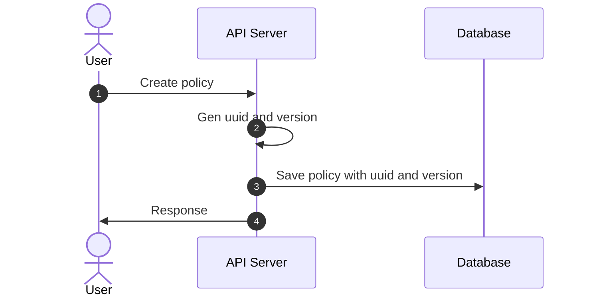
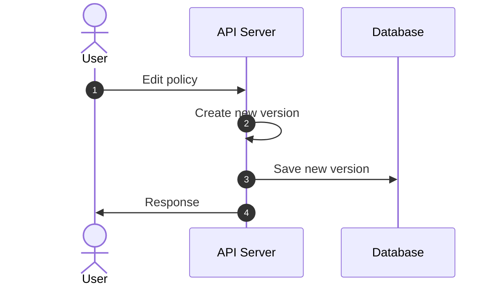
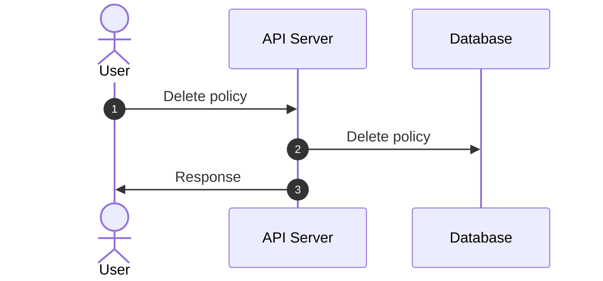
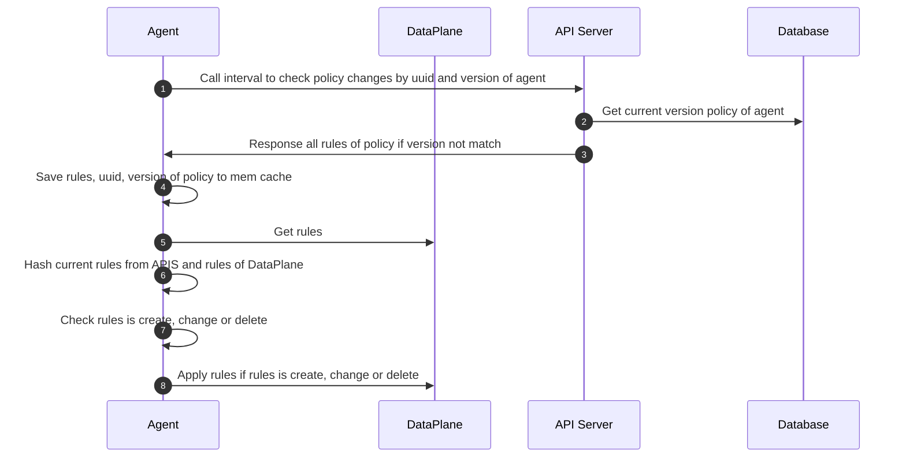
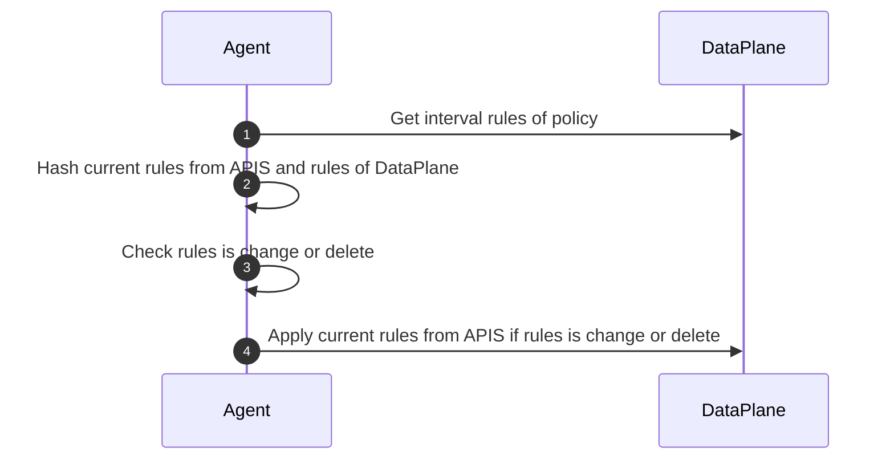

# Flow with policy

## Create from User


## Edit from User


## Delete from User


### Call interval from Agent to API-Server


### Interval check rules changes from DataPlane in Agent


## hash rule
```text
sha224(rule) -> hash
```

## Input Host Endpoint(json or yaml)
- represents one or more real or virtual interfaces attached to a host that is running bamboo-policy

```json
{
  "metadata": {
    "name": "",
    "labels": {
      "key": ""
    }
  },
  "spec": {
    "interface_name": "",
    "ips": [
      ""
    ],
    "ports": [
      {
        "name": "",
        "port": 0,
        "protocol": ""
      }
    ]
  },
  "description": ""
}
```

Definition

| Field       | Mandatory | Accepted Values | Schema                             | Description                           | Default value |
|-------------|-----------|-----------------|------------------------------------|---------------------------------------|---------------|
| metadata    | TRUE      |                 | [Metadata](#hostendpoint-metadata) | Metadata of host endpoint             |               |
| spec        | TRUE      |                 | [Spec](#hostendpoint-spec)         | Specific information of host endpoint |               |
| description | FALSE     |                 | string                             | Description                           |               |

<a id="hostendpoint-metadata">**Metadata**</a>

| Field  | Mandatory | Accepted Values | Schema               | Description                                               | Default value |
|--------|-----------|-----------------|----------------------|-----------------------------------------------------------|---------------|
| name   | TRUE      |                 | string               | name of host endpoint                                     |               |
| labels | TRUE      |                 | map[string]interface | used to validate the policy assigned to the host endpoint |               |

<a id="hostendpoint-spec">**Spec**</a>

| Field          | Mandatory | Accepted Values | Schema        | Description                                                 | Default value |
|----------------|-----------|-----------------|---------------|-------------------------------------------------------------|---------------|
| interface_name | TRUE      |                 | string        | The name of the specific interface on which to apply policy |               |
| ips            | TRUE      |                 | array string  | list ips of host endpoint                                   |               |
| ports          | TRUE      |                 | [Port](#port) | List of named ports that this workload exposes              |               |
| description    | FALSE     |                 | string        | Description                                                 |               |

<a id="port">**Port**</a>

| Field       | Mandatory | Accepted Values      | Schema  | Description                     | Default value |
|-------------|-----------|----------------------|---------|---------------------------------|---------------|
| name        | TRUE      |                      | string  | The name attach to this port    |               |
| protocol    | TRUE      | `TCP`, `UDP`, `SCTP` | String  | The protocol of this named port |               |
| port        | TRUE      | `1` - `65535`        | integer | The workload port number        |               |

## Input policy(json or yaml)

- represents an ordered set of rules which are applied to a collection of endpoint

```json
{
  "metadata": {
    "name": "",
    "project_id": 0,
    "tenant_id": 0
  },
  "description": "",
  "spec": {
    "selector": "",
    "types": [""],
    "ingress": {
      "metadata": {},
      "action": "",
      "protocol": "",
      "source": {
        "nets": [""],
        "ports": []
      },
      "destination": {
        "nets": [""],
        "ports": []
      }
    },
    "egress": {
      "metadata": {},
      "action": "",
      "protocol": "",
      "source": {
        "nets": [""],
        "ports": []
      },
      "destination": {
        "nets": [""],
        "ports": []
      }
    }
  }
}
```

Definition

| Field       | Mandatory | Accepted Values | Schema                       | Description                    | Default value |
|-------------|-----------|-----------------|------------------------------|--------------------------------|---------------|
| metadata    | TRUE      |                 | [Metadata](#policy-metadata) | Metadata of policy             |               |
| spec        | TRUE      |                 | [Spec](#policy-spec)         | Specific information of policy |               |
| description | FALSE     |                 | string                       | Description                    |               |

<a id="policy-metadata">**Metadata**</a>

| Field       | Mandatory | Accepted Values | Schema  | Description    | Default value |
|-------------|-----------|-----------------|---------|----------------|---------------|
| policy_name | TRUE      |                 | string  | Name of policy |               |
| project_id  | FALSE     |                 | integer | Project ID     |               |
| tenant_id   | FALSE     |                 | integer | Tenant ID      |               |

<a id="policy-spec">**Spec**</a>

| Field    | Mandatory | Accepted Values     | Schema        | Description                                              | Default value |
|----------|-----------|---------------------|---------------|----------------------------------------------------------|---------------|
| selector | TRUE      |                     | string        | Selects the endpoint to which this policy applies        | all()         |
| types    | TRUE      | `Ingress`, `Egress` | array string  | Applies the policy based on the direction of the traffic |               |
| ingress  | FALSE     |                     | [Rule](#rule) | Ordered list of ingress rules applied by policy          |               |
| egress   | FALSE     |                     | [Rule](#rule) | Ordered list of egress rules applied by policy           |               |

<a id="rule">**Rule**</a>

| Field       | Mandatory | Accepted Values                | Schema                     | Description                               | Default value |
|-------------|-----------|--------------------------------|----------------------------|-------------------------------------------|---------------|
| metadata    | FALSE     |                                | map[string]interface       |                                           |               |
| action      | TRUE      | `Allow`, `Deny`, `Log`, `Pass` | string                     | Action to perform when matching this rule |               |
| protocol    | TRUE      | `TCP`, `UDP`, `SCTP`, `ICMP`   | string                     | positive protocol match                   |               |
| source      | FALSE     |                                | [EntityRule](#entity_rule) | Source match parameter                    |               |
| destination | FALSE     |                                | [EntityRule](#entity_rule) | Destination match parameter               |               |

<a id="entity_rule">**EntityRule**</a>

| Field | Mandatory | Accepted Values | Schema        | Description                                     | Default value |
|-------|-----------|-----------------|---------------|-------------------------------------------------|---------------|
| nets  | FALSE     |                 | list of CIDRs | Match packets with IP in any of the list CIDRs  |               |
| ports | FALSE     |                 | string        | Positive match on the specified [ports](#ports) |               |

<a id="ports">**Ports**</a>

| Syntax    | Example    | Description                                                         |
|-----------|------------|---------------------------------------------------------------------|
| int       | 80         | The exact (numeric) port specified                                  |
| start:end | 1001:1010  | All numeric ports within the range start <= x <= end                |
| string    | named-port | A named port, as defined in the ports list of one or mores endpoint |
