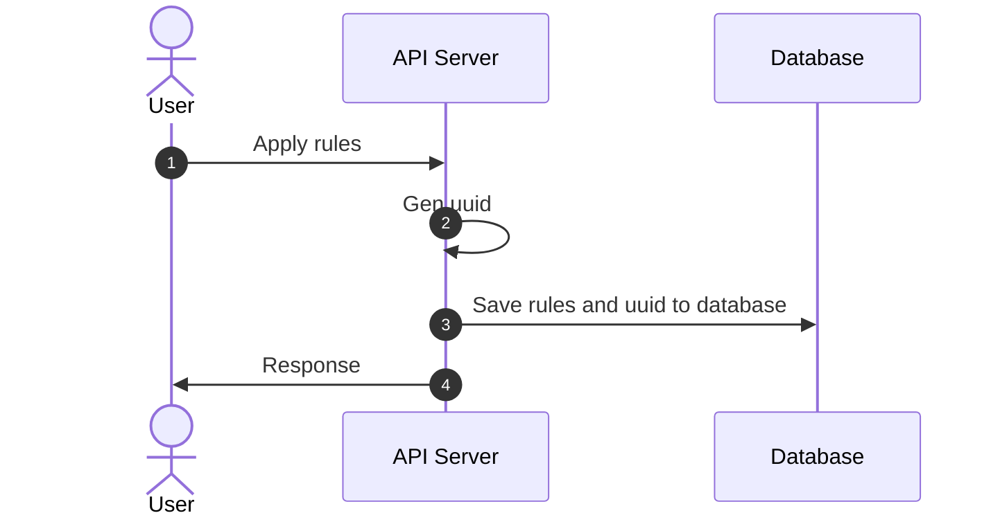
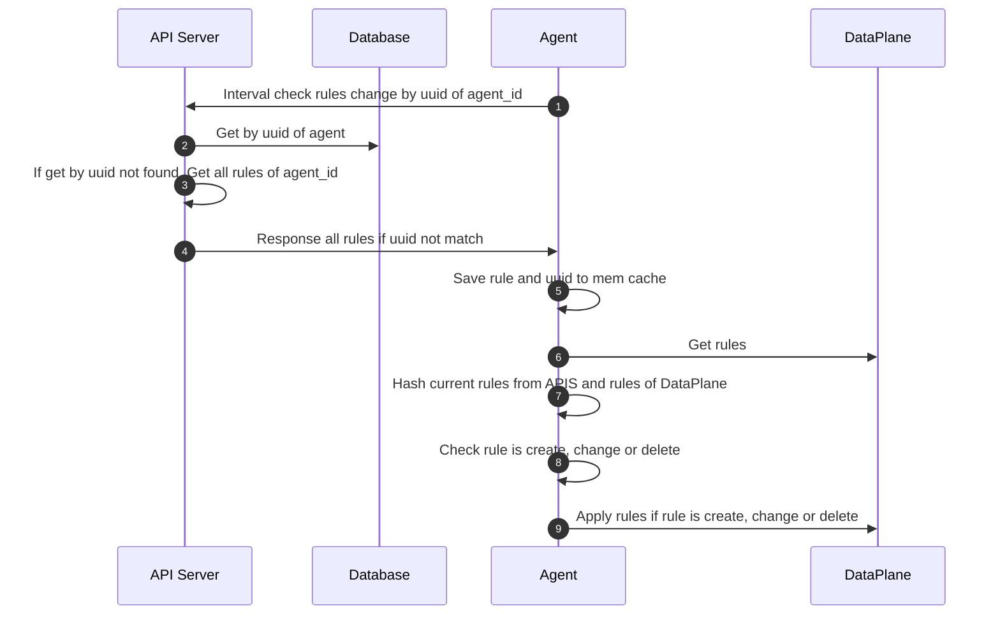
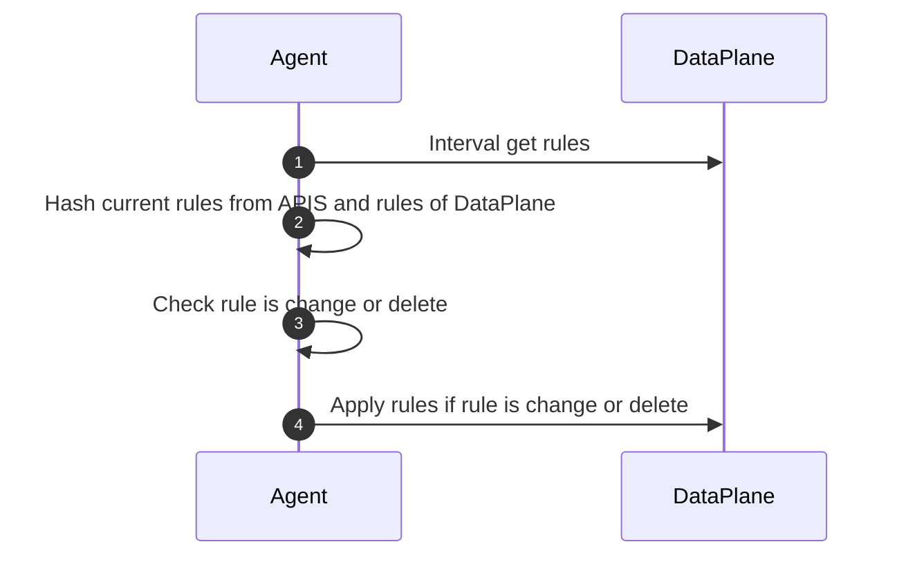
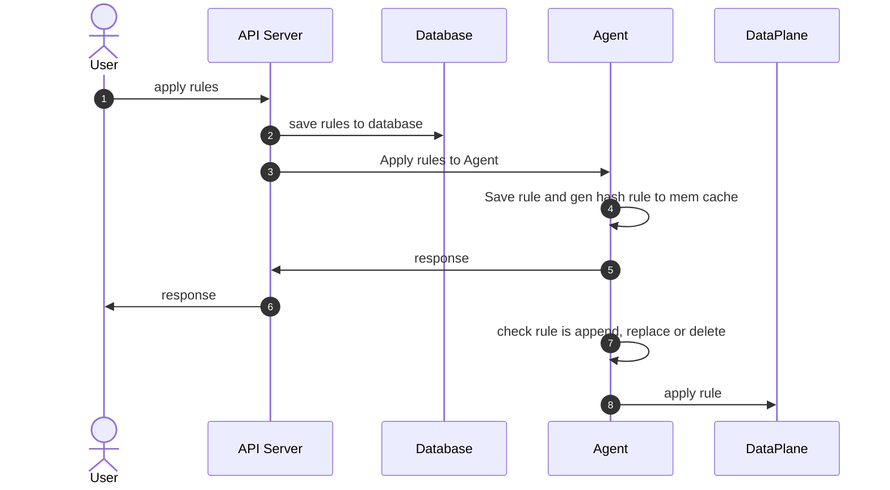

# Flow Apply rules

## Agent --> API-Server

### Apply rule from User



### Call interval from Agent to API-Server



### Interval check change rule from DataPlane in Agent



## API-Server <---> Agent

### Flow apply rule from API server



### Interval check change rule from DataPlane in Agent


## APIS <---> Agent(keep connection)

### Flow apply rule from API server


### Interval check change rule from DataPlane in Agent


## hash rule
```
sha224(rule) -> hash
```

## DataPlane
### ipset
### iptables
### nftables
### ebpf
