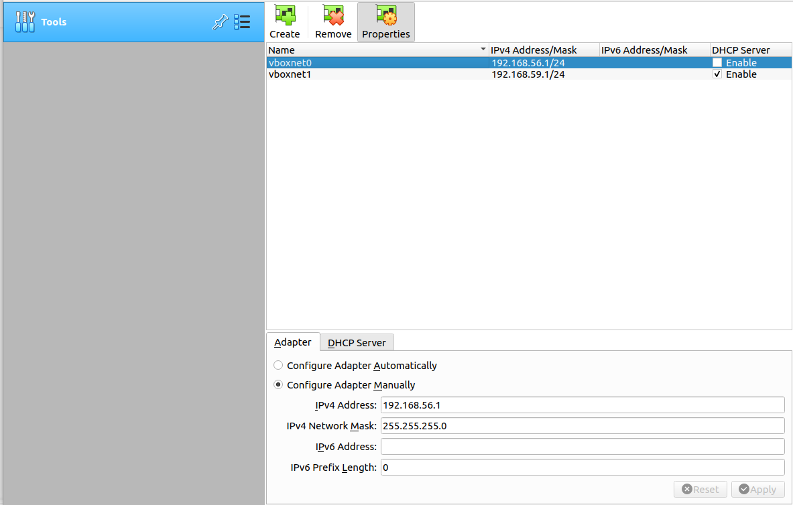
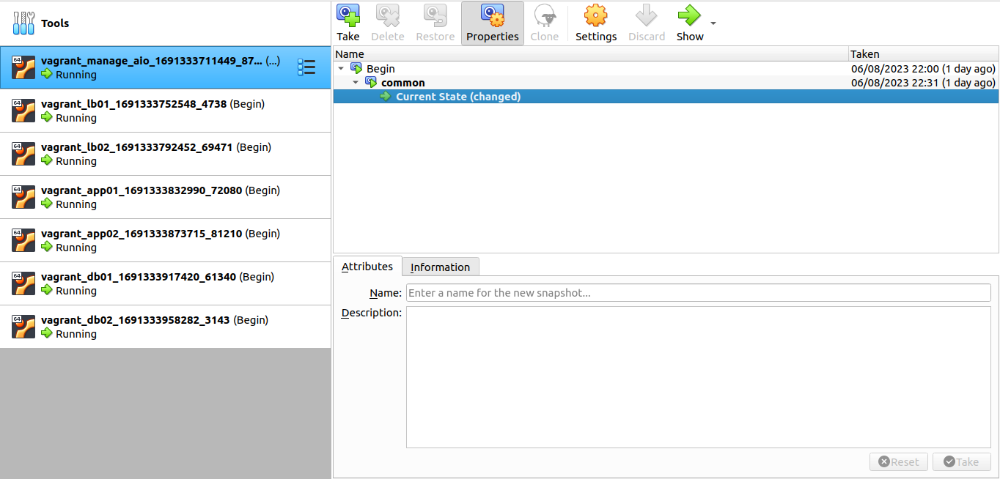

# Simple create VM demo 
| No  | HOSTNAME   | IPADDR             |
|-----|------------|--------------------|
| 1   | admin01    | 192.168.56.5       |
| 2   | lb[01-02]  | 192.168.56.[11-12] |
| 3   | app[01-02] | 192.168.56.[21-22] |
| 4   | db[01-02]  | 192.168.56.[31-32] |

## Prepare Virtualbox and vagrant 
- Install 
```sh 
sudo apt update -y
sudo apt install virtualbox vagrant -y 
```

- Config Vagrant network for demo 
<p align="center">
  
</p>

## Create VM 
- Create demo keypair
```sh 
ssh-keygen -t rsa -b 4096 -N "" -C "demo_bamboo@example.com" -f ./id_rsa
```

- Copy private key to playbook deploy server 
```sh 
cp id_rsa ../playbook
```

- Create VM
```sh 
vagrant up 
```

<p align="center">
  
</p>
